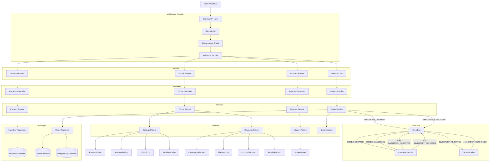
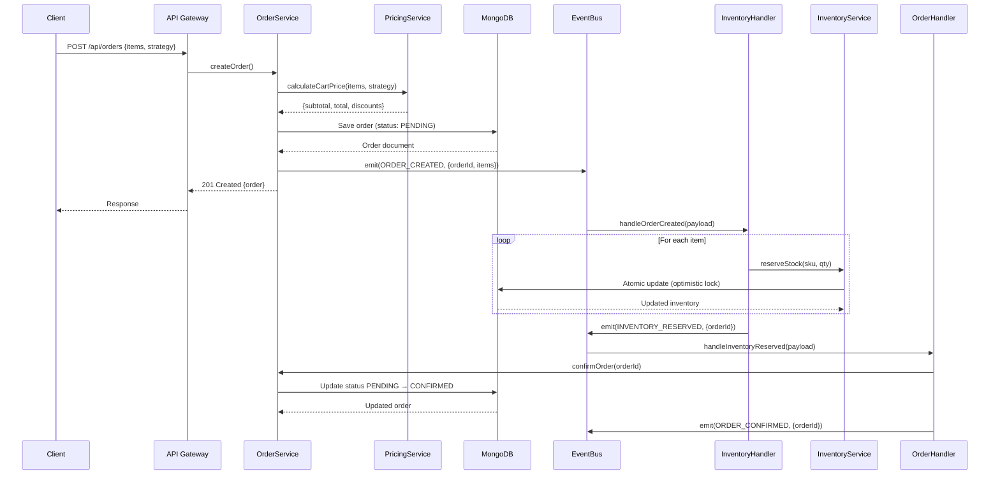
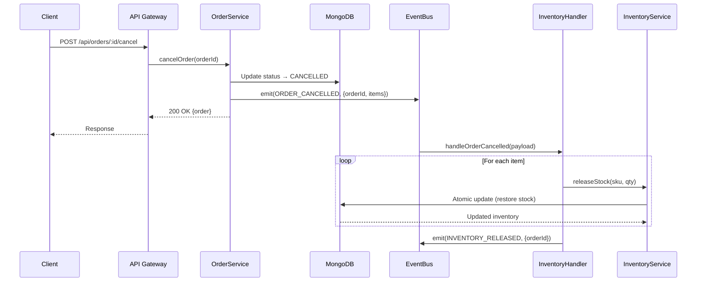
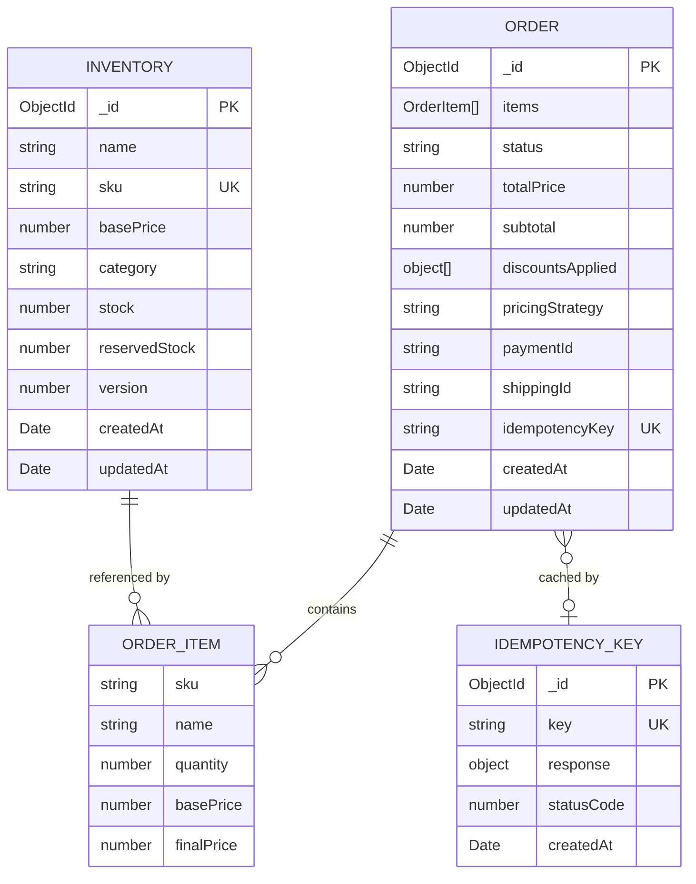
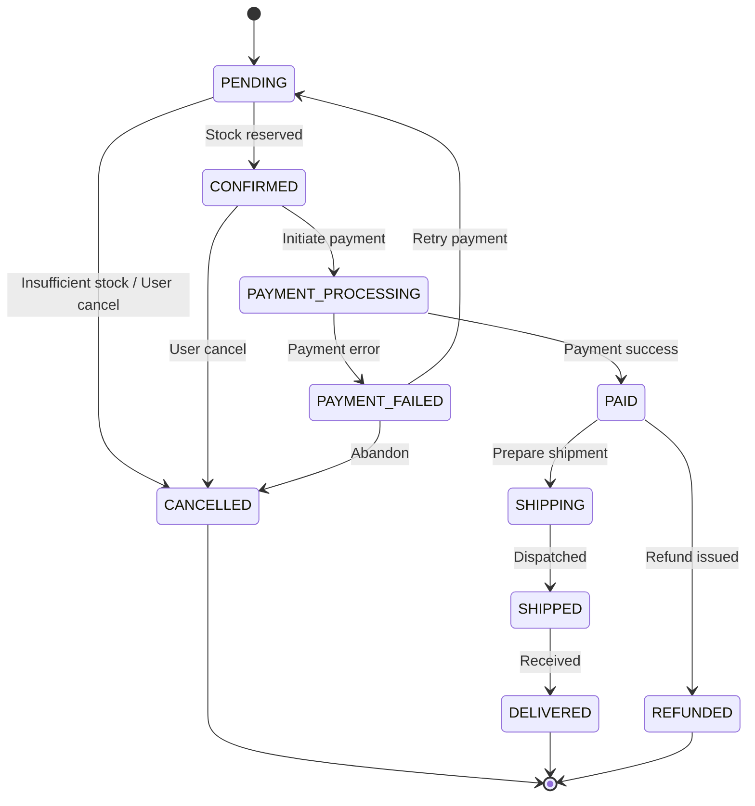
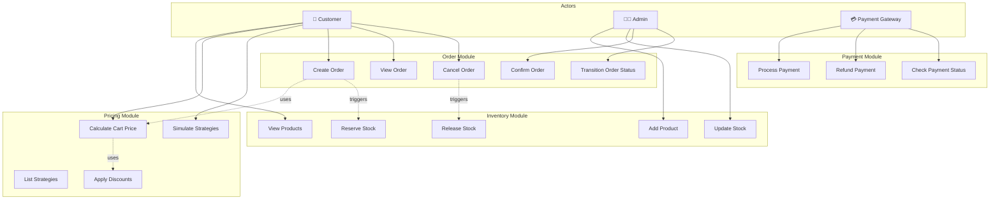
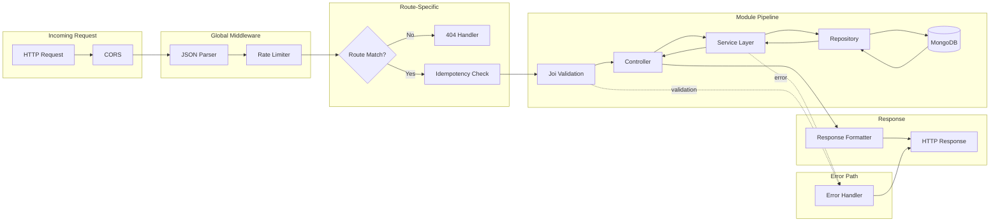
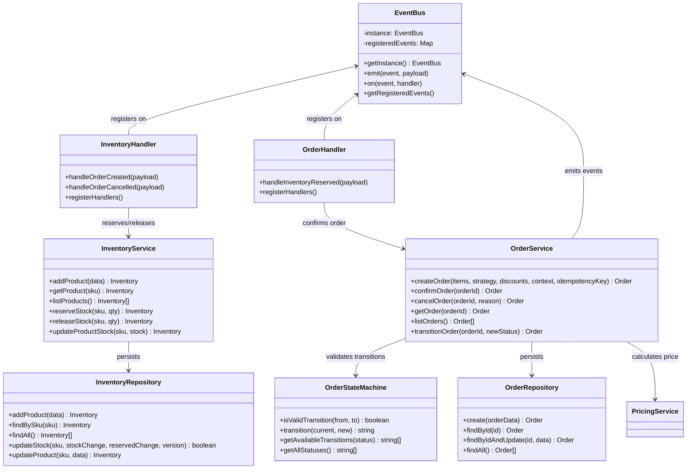

# Ecommerce Order Management Engine

An event-driven order management system built with **TypeScript**, Express.js, and MongoDB, demonstrating key software design patterns and system design principles.

## Setup

### Prerequisites

- Node.js 18+
- MongoDB (local or Atlas)

### Installation

```bash
npm install
cp .env.example .env
# Edit .env with your MongoDB URI
```

### Running

```bash
npm run dev     # Development with ts-node
npm run build   # Compile TypeScript
npm start       # Production (from dist/)
npm test        # Run all tests
```

## Project Structure

```
src/
├── app.ts                        # Express app setup & route mounting
├── server.ts                     # Server entry point & event handler registration
│
├── config/
│   ├── env.ts                    # Environment configuration (port, DB URI, log level)
│   └── database.ts               # MongoDB connection with retry logic
│
├── events/
│   ├── EventBus.ts               # Singleton event bus (Observer pattern)
│   └── handlers/
│       ├── inventoryHandlers.ts  # ORDER_CREATED → reserve stock, ORDER_CANCELLED → release
│       └── orderHandlers.ts      # INVENTORY_RESERVED → confirm order
│
├── inventory/
│   ├── inventoryModel.ts         # Mongoose schema (name, sku, stock, reservedStock, version)
│   ├── inventoryRepository.ts    # Data access layer (CRUD + atomic updates)
│   ├── inventoryService.ts       # Business logic (reserveStock, releaseStock with optimistic locking)
│   ├── inventoryController.ts    # HTTP request handlers
│   └── inventoryRoutes.ts        # Route definitions + Joi validation
│
├── pricing/
│   ├── strategies/
│   │   ├── PricingStrategy.ts    # Abstract base class (Strategy pattern interface)
│   │   ├── RegularPricing.ts     # Returns base price unchanged
│   │   ├── SeasonalPricing.ts    # Seasonal multipliers (summer 15%, holiday 25%, etc.)
│   │   ├── BulkPricing.ts        # Tiered volume discounts (10+ → 5%, 50+ → 15%, 100+ → 25%)
│   │   └── MemberPricing.ts      # Member tier discounts (Silver 5%, Gold 10%, Platinum 15%)
│   ├── decorators/
│   │   ├── DiscountDecorator.ts  # Abstract base class (Decorator pattern interface)
│   │   ├── PercentageDiscount.ts # Percentage-based discount (e.g., 10% off)
│   │   ├── FlatDiscount.ts       # Fixed amount discount (e.g., $5 off, floors at $0)
│   │   ├── CouponDiscount.ts     # Validates coupon codes, applies discount
│   │   └── LoyaltyDiscount.ts    # Loyalty tier discount (bronze through diamond)
│   ├── pricingService.ts         # Cart pricing calculation + strategy simulation
│   ├── pricingController.ts      # HTTP request handlers
│   └── pricingRoutes.ts          # Route definitions
│
├── orders/
│   ├── orderModel.ts             # Mongoose schema (items, status, totalPrice, idempotencyKey)
│   ├── orderStateMachine.ts      # State transition validation (PENDING → CONFIRMED → ...)
│   ├── orderRepository.ts        # Data access layer
│   ├── orderService.ts           # Business logic (create, confirm, cancel, transition)
│   ├── orderController.ts        # HTTP request handlers
│   ├── orderRoutes.ts            # Route definitions + Joi validation
│   └── idempotencyModel.ts       # Idempotency key storage (24h TTL)
│
├── payments/
│   ├── adapters/
│   │   ├── PaymentAdapter.ts     # Abstract interface (processPayment, refundPayment, getStatus)
│   │   └── StripeAdapter.ts      # Stub implementation (returns mock success)
│   ├── paymentService.ts         # Payment orchestration with adapter selection
│   └── paymentRoutes.ts          # Routes defined, handlers return 501 Not Implemented
│
├── middleware/
│   ├── errorHandler.ts           # Centralized error handling
│   ├── validateRequest.ts        # Joi schema validation wrapper
│   ├── rateLimiter.ts            # Rate limiting (100 req/15min)
│   └── idempotencyMiddleware.ts  # Duplicate request protection via Idempotency-Key header
│
├── utils/
│   ├── responseFormatter.ts      # Standard API response envelope { success, data, error }
│   ├── logger.ts                 # Winston logger setup
│   └── constants.ts              # Event names & order status constants
│
└── types/
    └── express.d.ts              # Express Request type augmentation (validatedBody)

tests/
├── unit/
│   ├── pricing/
│   │   ├── strategies.test.ts    # Strategy pattern correctness (14 tests)
│   │   └── decorators.test.ts    # Decorator composition & edge cases (14 tests)
│   └── orders/
│       └── orderStateMachine.test.ts  # State transition validation (8 tests)
├── integration/                  # (reserved for integration tests)
└── tsconfig.json

docs/
└── ARCHITECTURE.md               # Detailed architecture documentation
```

---

## System Architecture

### Module Dependency Graph



---

### Event Flow — Order Creation



---

### Event Flow — Order Cancellation (Compensating Action)



---

## Entity-Relationship Diagram



---

## Order State Machine



---

## Use Case Diagram



---

## Request Pipeline



---

## Class Diagram — Pricing Engine

```mermaid
classDiagram
    class PricingStrategy {
        <<abstract>>
        +calculatePrice(basePrice, context)* PricingResult
    }

    class RegularPricing {
        +calculatePrice(basePrice, context) PricingResult
    }

    class SeasonalPricing {
        -SEASON_MULTIPLIERS
        +calculatePrice(basePrice, context) PricingResult
    }

    class BulkPricing {
        -BULK_TIERS
        +calculatePrice(basePrice, context) PricingResult
    }

    class MemberPricing {
        -MEMBER_DISCOUNTS
        +calculatePrice(basePrice, context) PricingResult
    }

    class DiscountDecorator {
        <<abstract>>
        +wrappedPricing
        +apply(priceResult, context)* PricingResult
    }

    class PercentageDiscount {
        -percentage
        +apply(priceResult, context) PricingResult
    }

    class FlatDiscount {
        -amount
        +apply(priceResult, context) PricingResult
    }

    class CouponDiscount {
        -VALID_COUPONS
        +apply(priceResult, context) PricingResult
    }

    class LoyaltyDiscount {
        -LOYALTY_DISCOUNTS
        +apply(priceResult, context) PricingResult
    }

    class PricingService {
        +calculateItemPrice(item, strategy, discounts, context) ItemResult
        +calculateCartPrice(items, strategy, discounts, context) CartResult
        +simulateStrategies(items, context) StrategyMap
        +getAvailableStrategies() StrategyInfo[]
    }

    PricingStrategy <|-- RegularPricing
    PricingStrategy <|-- SeasonalPricing
    PricingStrategy <|-- BulkPricing
    PricingStrategy <|-- MemberPricing

    DiscountDecorator <|-- PercentageDiscount
    DiscountDecorator <|-- FlatDiscount
    DiscountDecorator <|-- CouponDiscount
    DiscountDecorator <|-- LoyaltyDiscount

    PricingService --> PricingStrategy : uses
    PricingService --> DiscountDecorator : uses
```



---

## Class Diagram — Order & Inventory



---

## API Endpoints

### Inventory

| Method | Endpoint | Description |
|--------|----------|-------------|
| GET | `/api/inventory` | List all products |
| GET | `/api/inventory/:sku` | Get product by SKU |
| POST | `/api/inventory` | Add new product |
| PATCH | `/api/inventory/:sku/stock` | Update stock level |

### Pricing

| Method | Endpoint | Description |
|--------|----------|-------------|
| POST | `/api/pricing/calculate` | Calculate cart pricing |
| POST | `/api/pricing/simulate` | Compare all strategies side-by-side |
| GET | `/api/pricing/strategies` | List available strategies |

### Orders

| Method | Endpoint | Description |
|--------|----------|-------------|
| POST | `/api/orders` | Create order (supports Idempotency-Key header) |
| GET | `/api/orders` | List all orders |
| GET | `/api/orders/:id` | Get order by ID |
| POST | `/api/orders/:id/confirm` | Confirm order (PENDING → CONFIRMED) |
| POST | `/api/orders/:id/cancel` | Cancel order (triggers stock release) |
| POST | `/api/orders/:id/transition` | Transition order to any valid status |
| GET | `/api/orders/transitions` | View full state machine transitions |

### Payments

| Method | Endpoint | Description |
|--------|----------|-------------|
| POST | `/api/payments/process` | Process payment (stub — 501) |
| POST | `/api/payments/:id/refund` | Refund payment (stub — 501) |
| GET | `/api/payments/:id/status` | Check payment status (stub — 501) |

---

## Design Patterns

| Pattern | Location | Purpose |
|---------|----------|---------|
| **Observer** | `EventBus.ts` | Event-driven communication between decoupled modules |
| **Strategy** | `pricing/strategies/` | Runtime pricing algorithm swap (OCP) |
| **Decorator** | `pricing/decorators/` | Composable discount stacking without inheritance explosion |
| **Adapter** | `payments/adapters/` | Payment provider abstraction (DIP) |
| **State Machine** | `orders/orderStateMachine.ts` | Enforced order lifecycle transitions |
| **Repository** | `*Repository.ts` | Data access abstraction from business logic |
| **Singleton** | `EventBus.ts` | Single event bus instance across the application |
| **Middleware** | `middleware/` | Cross-cutting concerns (validation, rate limiting, idempotency) |

## Testing

```bash
npm test          # All tests
npm run test:unit # Unit tests only
```

**Test Coverage: 36 tests passing**

| Test File | Tests | What It Validates |
|-----------|-------|-------------------|
| `strategies.test.ts` | 14 | Each strategy returns correct prices, runtime switching |
| `decorators.test.ts` | 14 | Each decorator applies correctly, composition, edge cases |
| `orderStateMachine.test.ts` | 8 | Valid/invalid transitions, terminal states |
