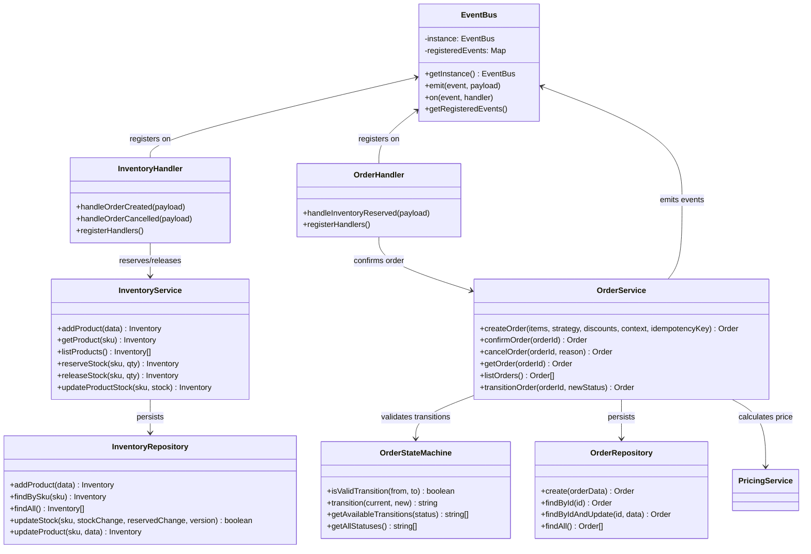

```mermaid
classDiagram
    class EventBus {
        -instance: EventBus
        -registeredEvents: Map
        +getInstance() EventBus
        +emit(event, payload)
        +on(event, handler)
        +getRegisteredEvents()
    }

    class OrderService {
        +createOrder(items, strategy, discounts, context, idempotencyKey) Order
        +confirmOrder(orderId) Order
        +cancelOrder(orderId, reason) Order
        +getOrder(orderId) Order
        +listOrders() Order[]
        +transitionOrder(orderId, newStatus) Order
    }

    class OrderStateMachine {
        +isValidTransition(from, to) boolean
        +transition(current, new) string
        +getAvailableTransitions(status) string[]
        +getAllStatuses() string[]
    }

    class OrderRepository {
        +create(orderData) Order
        +findById(id) Order
        +findByIdAndUpdate(id, data) Order
        +findAll() Order[]
    }

    class InventoryService {
        +addProduct(data) Inventory
        +getProduct(sku) Inventory
        +listProducts() Inventory[]
        +reserveStock(sku, qty) Inventory
        +releaseStock(sku, qty) Inventory
        +updateProductStock(sku, stock) Inventory
    }

    class InventoryRepository {
        +addProduct(data) Inventory
        +findBySku(sku) Inventory
        +findAll() Inventory[]
        +updateStock(sku, stockChange, reservedChange, version) boolean
        +updateProduct(sku, data) Inventory
    }

    class InventoryHandler {
        +handleOrderCreated(payload)
        +handleOrderCancelled(payload)
        +registerHandlers()
    }

    class OrderHandler {
        +handleInventoryReserved(payload)
        +registerHandlers()
    }

    EventBus <-- InventoryHandler : registers on
    EventBus <-- OrderHandler : registers on
    OrderService --> OrderStateMachine : validates transitions
    OrderService --> OrderRepository : persists
    OrderService --> EventBus : emits events
    OrderService --> PricingService : calculates price
    InventoryHandler --> InventoryService : reserves/releases
    OrderHandler --> OrderService : confirms order
    InventoryService --> InventoryRepository : persists
```
