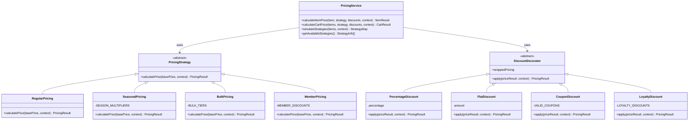

```mermaid
classDiagram
    class PricingStrategy {
        <<abstract>>
        +calculatePrice(basePrice, context)* PricingResult
    }

    class RegularPricing {
        +calculatePrice(basePrice, context) PricingResult
    }

    class SeasonalPricing {
        -SEASON_MULTIPLIERS
        +calculatePrice(basePrice, context) PricingResult
    }

    class BulkPricing {
        -BULK_TIERS
        +calculatePrice(basePrice, context) PricingResult
    }

    class MemberPricing {
        -MEMBER_DISCOUNTS
        +calculatePrice(basePrice, context) PricingResult
    }

    class DiscountDecorator {
        <<abstract>>
        +wrappedPricing
        +apply(priceResult, context)* PricingResult
    }

    class PercentageDiscount {
        -percentage
        +apply(priceResult, context) PricingResult
    }

    class FlatDiscount {
        -amount
        +apply(priceResult, context) PricingResult
    }

    class CouponDiscount {
        -VALID_COUPONS
        +apply(priceResult, context) PricingResult
    }

    class LoyaltyDiscount {
        -LOYALTY_DISCOUNTS
        +apply(priceResult, context) PricingResult
    }

    class PricingService {
        +calculateItemPrice(item, strategy, discounts, context) ItemResult
        +calculateCartPrice(items, strategy, discounts, context) CartResult
        +simulateStrategies(items, context) StrategyMap
        +getAvailableStrategies() StrategyInfo[]
    }

    PricingStrategy <|-- RegularPricing
    PricingStrategy <|-- SeasonalPricing
    PricingStrategy <|-- BulkPricing
    PricingStrategy <|-- MemberPricing

    DiscountDecorator <|-- PercentageDiscount
    DiscountDecorator <|-- FlatDiscount
    DiscountDecorator <|-- CouponDiscount
    DiscountDecorator <|-- LoyaltyDiscount

    PricingService --> PricingStrategy : uses
    PricingService --> DiscountDecorator : uses
```
