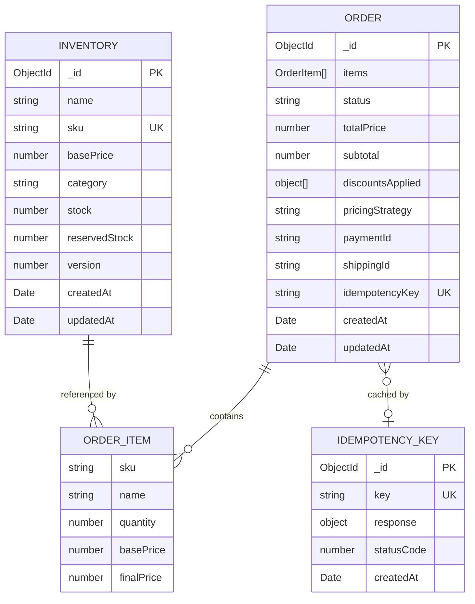

```mermaid
erDiagram
    INVENTORY {
        ObjectId _id PK
        string name
        string sku UK
        number basePrice
        string category
        number stock
        number reservedStock
        number version
        Date createdAt
        Date updatedAt
    }

    ORDER {
        ObjectId _id PK
        OrderItem[] items
        string status
        number totalPrice
        number subtotal
        object[] discountsApplied
        string pricingStrategy
        string paymentId
        string shippingId
        string idempotencyKey UK
        Date createdAt
        Date updatedAt
    }

    ORDER_ITEM {
        string sku
        string name
        number quantity
        number basePrice
        number finalPrice
    }

    IDEMPOTENCY_KEY {
        ObjectId _id PK
        string key UK
        object response
        number statusCode
        Date createdAt
    }

    INVENTORY ||--o{ ORDER_ITEM : "referenced by"
    ORDER ||--o{ ORDER_ITEM : "contains"
    ORDER }o--o| IDEMPOTENCY_KEY : "cached by"
```
