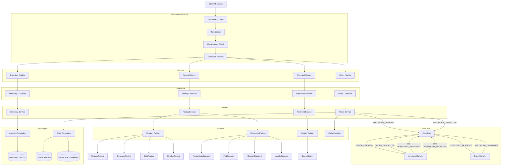

```mermaid
graph TB
    Client[Client / Postman] --> API[Express API Layer]

    subgraph "Middleware Pipeline"
        API --> RL[Rate Limiter]
        RL --> ID[Idempotency Check]
        ID --> VH[Validation Handler]
    end

    subgraph "Routes"
        VH --> IR[Inventory Routes]
        VH --> PR[Pricing Routes]
        VH --> OR[Order Routes]
        VH --> PaR[Payment Routes]
    end

    subgraph "Controllers"
        IR --> IC[Inventory Controller]
        PR --> PC[Pricing Controller]
        OR --> OC[Order Controller]
        PaR --> PaC[Payment Controller]
    end

    subgraph "Services"
        IC --> IS[Inventory Service]
        PC --> PS[Pricing Service]
        OC --> OS[Order Service]
        PaC --> PaS[Payment Service]
    end

    subgraph "Event Bus"
        OS -->|emit ORDER_CREATED| EB[EventBus]
        OS -->|emit ORDER_CANCELLED| EB
        EB -->|ORDER_CREATED| IH[Inventory Handler]
        EB -->|ORDER_CANCELLED| IH
        EB -->|INVENTORY_RESERVED| OH[Order Handler]
        IH -->|emit INVENTORY_RESERVED| EB
        IH -->|emit INVENTORY_RELEASED| EB
        OH -->|emit ORDER_CONFIRMED| EB
    end

    subgraph "Data Layer"
        IS --> IRep[Inventory Repository]
        OS --> ORep[Order Repository]
        IRep --> IM[(Inventory Collection)]
        ORep --> OM[(Order Collection)]
        ORep --> IK[(Idempotency Collection)]
    end

    subgraph "Patterns"
        PS --> STRAT[Strategy Pattern]
        PS --> DECOR[Decorator Pattern]
        PaS --> ADAPT[Adapter Pattern]
        OS --> FSM[State Machine]
    end

    STRAT --> Reg[RegularPricing]
    STRAT --> Seas[SeasonalPricing]
    STRAT --> Bulk[BulkPricing]
    STRAT --> Memb[MemberPricing]

    DECOR --> Pct[PercentageDiscount]
    DECOR --> Flat[FlatDiscount]
    DECOR --> Coup[CouponDiscount]
    DECOR --> Loy[LoyaltyDiscount]

    ADAPT --> Stripe[StripeAdapter]
```
