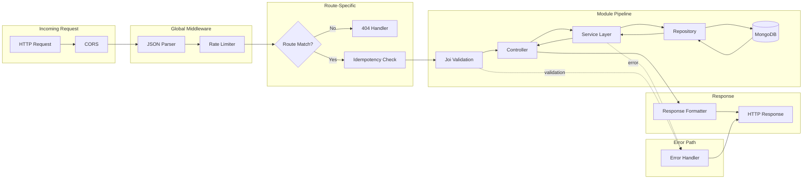

```mermaid
flowchart LR
    subgraph "Incoming Request"
        A[HTTP Request] --> B[CORS]
    end

    subgraph "Global Middleware"
        B --> C[JSON Parser]
        C --> D[Rate Limiter]
    end

    subgraph "Route-Specific"
        D --> E{Route Match?}
        E -->|No| F[404 Handler]
        E -->|Yes| G[Idempotency Check]
    end

    subgraph "Module Pipeline"
        G --> H[Joi Validation]
        H --> I[Controller]
        I --> J[Service Layer]
        J --> K[Repository]
        K --> L[(MongoDB)]
    end

    subgraph "Response"
        L --> K
        K --> J
        J --> I
        I --> M[Response Formatter]
        M --> N[HTTP Response]
    end

    subgraph "Error Path"
        J -.->|error| O[Error Handler]
        H -.->|validation| O
        O --> N
    end
```
