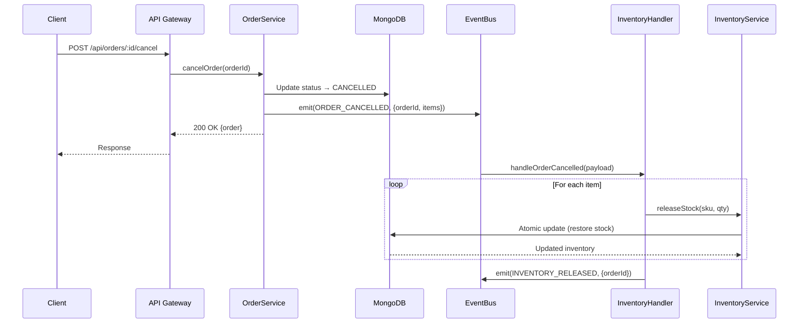

```mermaid
sequenceDiagram
    participant C as Client
    participant API as API Gateway
    participant OS as OrderService
    participant DB as MongoDB
    participant EB as EventBus
    participant IH as InventoryHandler
    participant IS as InventoryService

    C->>API: POST /api/orders/:id/cancel
    API->>OS: cancelOrder(orderId)
    OS->>DB: Update status → CANCELLED
    OS->>EB: emit(ORDER_CANCELLED, {orderId, items})
    OS-->>API: 200 OK {order}
    API-->>C: Response

    EB->>IH: handleOrderCancelled(payload)
    loop For each item
        IH->>IS: releaseStock(sku, qty)
        IS->>DB: Atomic update (restore stock)
        DB-->>IS: Updated inventory
    end
    IH->>EB: emit(INVENTORY_RELEASED, {orderId})
```
