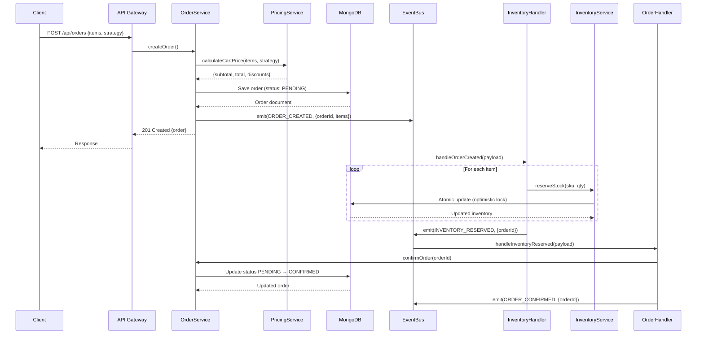

```mermaid
sequenceDiagram
    participant C as Client
    participant API as API Gateway
    participant OS as OrderService
    participant PS as PricingService
    participant DB as MongoDB
    participant EB as EventBus
    participant IH as InventoryHandler
    participant IS as InventoryService
    participant OH as OrderHandler

    C->>API: POST /api/orders {items, strategy}
    API->>OS: createOrder()
    OS->>PS: calculateCartPrice(items, strategy)
    PS-->>OS: {subtotal, total, discounts}
    OS->>DB: Save order (status: PENDING)
    DB-->>OS: Order document
    OS->>EB: emit(ORDER_CREATED, {orderId, items})
    OS-->>API: 201 Created {order}
    API-->>C: Response

    EB->>IH: handleOrderCreated(payload)
    loop For each item
        IH->>IS: reserveStock(sku, qty)
        IS->>DB: Atomic update (optimistic lock)
        DB-->>IS: Updated inventory
    end
    IH->>EB: emit(INVENTORY_RESERVED, {orderId})

    EB->>OH: handleInventoryReserved(payload)
    OH->>OS: confirmOrder(orderId)
    OS->>DB: Update status PENDING → CONFIRMED
    DB-->>OS: Updated order
    OH->>EB: emit(ORDER_CONFIRMED, {orderId})
```
