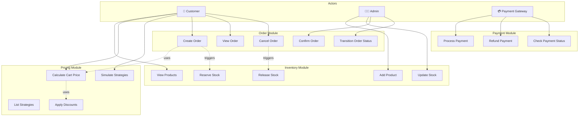

```mermaid
graph TB
    subgraph "Actors"
        Customer[👤 Customer]
        Admin[👨‍💼 Admin]
        PaymentGateway[💳 Payment Gateway]
    end

    subgraph "Inventory Module"
        UC1[Add Product]
        UC2[View Products]
        UC3[Update Stock]
        UC4[Reserve Stock]
        UC5[Release Stock]
    end

    subgraph "Pricing Module"
        UC6[Calculate Cart Price]
        UC7[Simulate Strategies]
        UC8[List Strategies]
        UC9[Apply Discounts]
    end

    subgraph "Order Module"
        UC10[Create Order]
        UC11[View Order]
        UC12[Confirm Order]
        UC13[Cancel Order]
        UC14[Transition Order Status]
    end

    subgraph "Payment Module"
        UC15[Process Payment]
        UC16[Refund Payment]
        UC17[Check Payment Status]
    end

    Customer --> UC2
    Customer --> UC6
    Customer --> UC7
    Customer --> UC10
    Customer --> UC11
    Customer --> UC13

    Admin --> UC1
    Admin --> UC3
    Admin --> UC12
    Admin --> UC14

    PaymentGateway --> UC15
    PaymentGateway --> UC16
    PaymentGateway --> UC17

    UC10 -.->|uses| UC6
    UC10 -.->|triggers| UC4
    UC13 -.->|triggers| UC5
    UC6 -.->|uses| UC9
```
