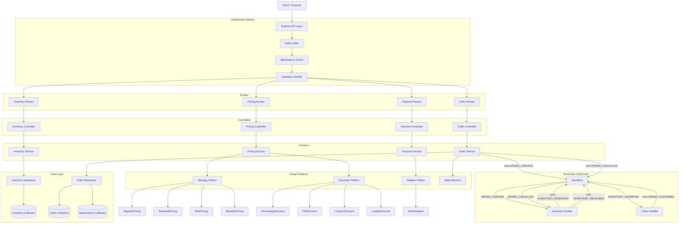
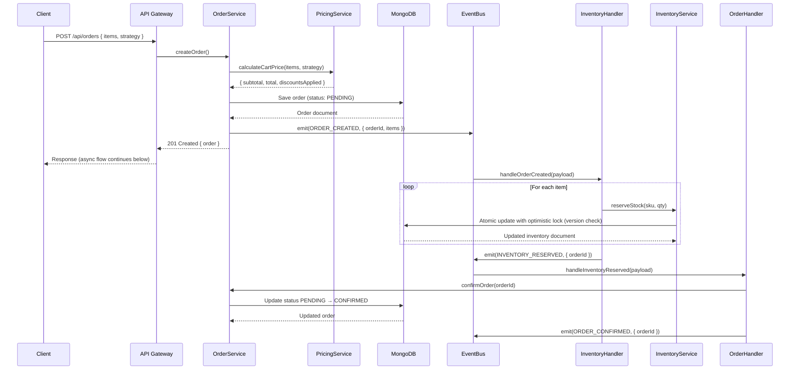
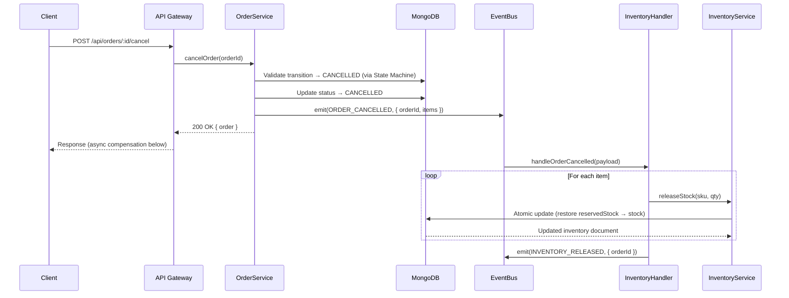
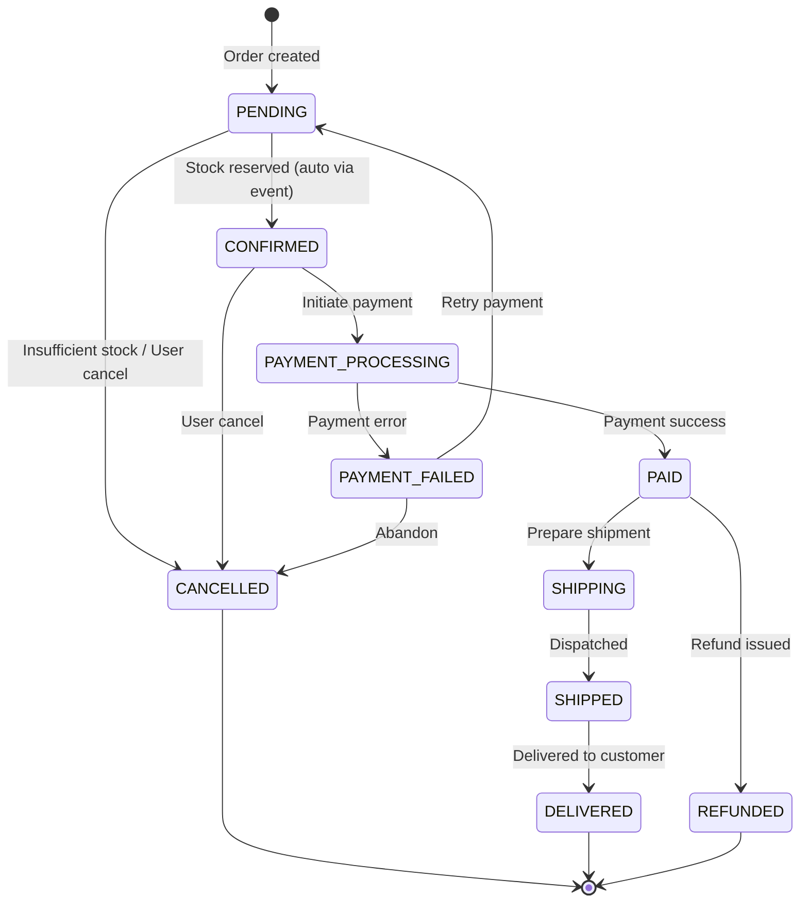
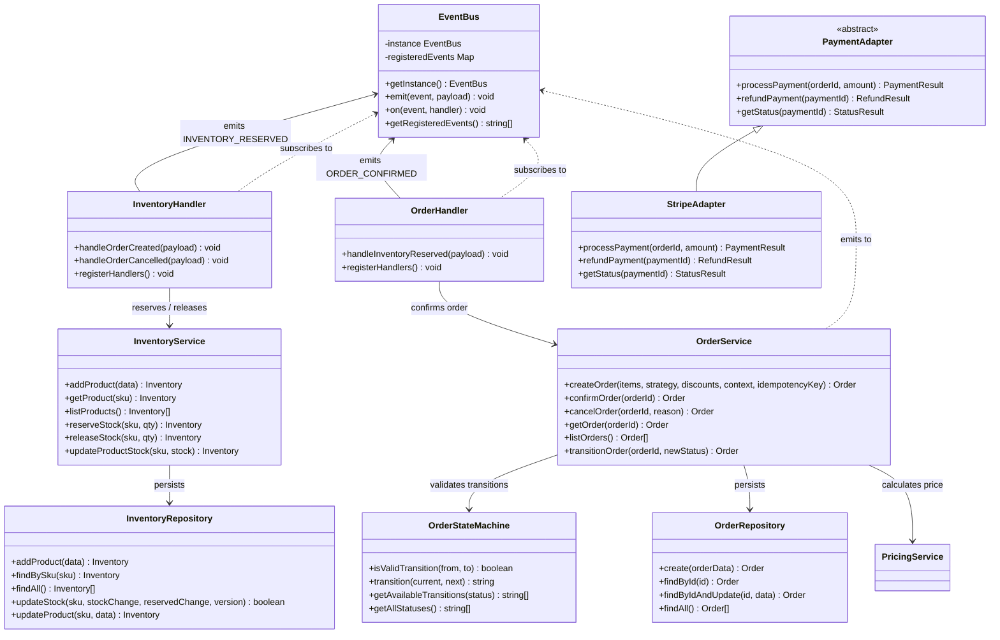
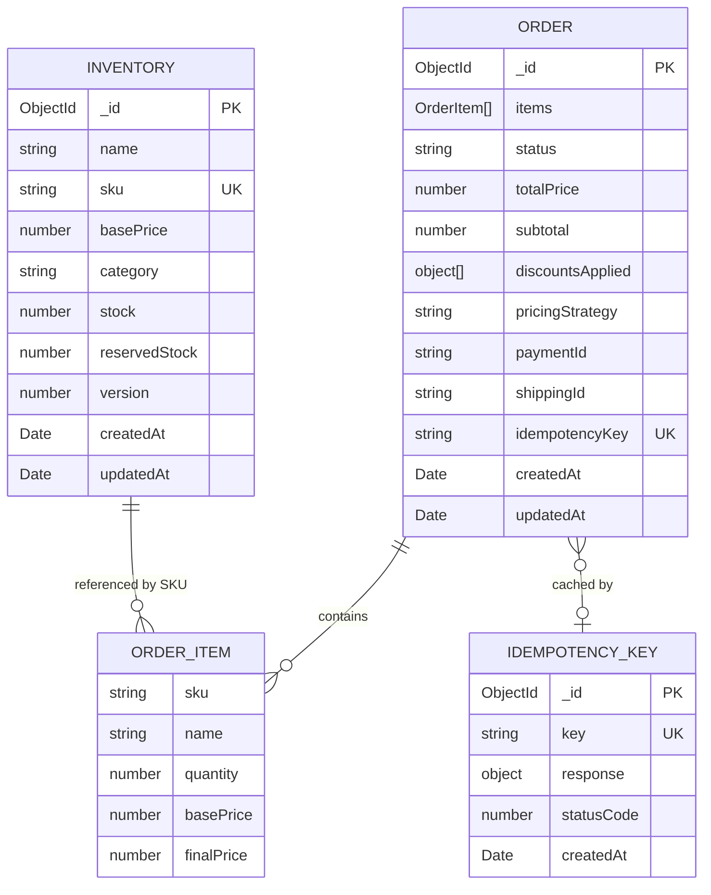

# Architecture Overview — Event-Driven E-Commerce Order Management & Pricing Engine

> **Stack:** TypeScript · Express.js · MongoDB · EventBus (Observer Pattern)

---

## Table of Contents

1. [High-Level System Architecture](#1-high-level-system-architecture)
2. [Module Dependency Graph](#2-module-dependency-graph)
3. [Request Pipeline](#3-request-pipeline)
4. [Event Flow — Order Creation](#4-event-flow--order-creation)
5. [Event Flow — Order Cancellation](#5-event-flow--order-cancellation)
6. [Order State Machine](#6-order-state-machine)
7. [Pricing Engine — Class Diagram](#7-pricing-engine--class-diagram)
8. [Order & Inventory — Class Diagram](#8-order--inventory--class-diagram)
9. [Entity-Relationship Diagram](#9-entity-relationship-diagram)
10. [Design Patterns Summary](#10-design-patterns-summary)
11. [API Endpoints Reference](#11-api-endpoints-reference)

---

## 1. High-Level System Architecture

```
┌─────────────────────────────────────────────────────────────────────┐
│                          CLIENT LAYER                               │
│                  HTTP Requests (REST API / Postman)                 │
└────────────────────────────┬────────────────────────────────────────┘
                             │
┌────────────────────────────▼────────────────────────────────────────┐
│                       MIDDLEWARE PIPELINE                           │
│   CORS → JSON Parser → Rate Limiter → Idempotency → Joi Validation  │
└────┬──────────────┬───────────────┬──────────────┬──────────────────┘
     │              │               │              │
┌────▼───┐   ┌──────▼──┐   ┌───────▼──┐   ┌───────▼──────┐
│Inventory│   │ Pricing │   │  Orders  │   │   Payments   │
│ Routes  │   │  Routes │   │  Routes  │   │   Routes     │
└────┬────┘   └──────┬──┘   └───────┬──┘   └───────┬──────┘
     │               │              │               │
┌────▼────┐   ┌──────▼──┐   ┌───────▼──┐   ┌───────▼──────┐
│Inventory│   │ Pricing │   │  Order   │   │   Payment    │
│Controller│  │Controller│  │Controller│   │  Controller  │
└────┬────┘   └──────┬──┘   └───────┬──┘   └───────┬──────┘
     │               │              │               │
┌────▼────┐   ┌──────▼──┐   ┌───────▼──┐   ┌───────▼──────┐
│Inventory│   │ Pricing │   │  Order   │   │   Payment    │
│ Service │   │ Service │   │  Service │   │   Service    │
└────┬────┘   └──────┬──┘   └───┬───┬──┘   └───────┬──────┘
     │               │          │   │               │
     │         ┌─────┴──────┐   │   │        ┌──────▼──────┐
     │         │  Strategy  │   │   │        │   Adapter   │
     │         │ + Decorator│   │   │        │  (Stripe)   │
     │         └────────────┘   │   │        └─────────────┘
     │                          │   │
┌────▼────────────────┐  ┌──────▼───▼─────────────────────────┐
│ Inventory Repository│  │           EVENT BUS                  │
└────┬────────────────┘  │  ORDER_CREATED → InventoryHandler   │
     │                   │  ORDER_CANCELLED → InventoryHandler  │
     │                   │  INVENTORY_RESERVED → OrderHandler   │
     │                   └──────────────────────────────────────┘
┌────▼────────────────────────────────────────────────────────┐
│                        DATA LAYER (MongoDB)                  │
│       Inventory Collection · Orders Collection · Idempotency │
└─────────────────────────────────────────────────────────────┘
```

---

## 2. Module Dependency Graph



---

## 3. Request Pipeline

```mermaid
flowchart LR
    subgraph Incoming["Incoming Request"]
        A[HTTP Request] --> B[CORS]
    end

    subgraph Global["Global Middleware"]
        B --> C[JSON Parser]
        C --> D[Rate Limiter\n100 req / 15 min]
    end

    subgraph Route["Route-Specific"]
        D --> E{Route Match?}
        E -->|No| F[404 Handler]
        E -->|Yes| G[Idempotency Check]
    end

    subgraph Module["Module Pipeline"]
        G --> H[Joi Validation]
        H --> I[Controller]
        I --> J[Service Layer]
        J --> K[Repository]
        K --> L[(MongoDB)]
    end

    subgraph Response
        L --> K2[Repository]
        K2 --> J2[Service]
        J2 --> I2[Controller]
        I2 --> M[Response Formatter\n{ success, data, error }]
        M --> N[HTTP Response]
    end

    subgraph Errors["Error Path"]
        J -.->|throws| O[Centralized\nError Handler]
        H -.->|validation fail| O
        O --> N
    end
```

---

## 4. Event Flow — Order Creation



---

## 5. Event Flow — Order Cancellation

Cancellation triggers a **compensating transaction** to restore reserved inventory.



---

## 6. Order State Machine



**Valid Transitions Table:**

| From | To | Trigger |
|------|-----|---------|
| `PENDING` | `CONFIRMED` | `INVENTORY_RESERVED` event |
| `PENDING` | `CANCELLED` | Insufficient stock / user request |
| `CONFIRMED` | `PAYMENT_PROCESSING` | Initiate payment |
| `CONFIRMED` | `CANCELLED` | User cancel |
| `PAYMENT_PROCESSING` | `PAID` | Payment success |
| `PAYMENT_PROCESSING` | `PAYMENT_FAILED` | Payment error |
| `PAYMENT_FAILED` | `PENDING` | Retry |
| `PAYMENT_FAILED` | `CANCELLED` | Abandon |
| `PAID` | `SHIPPING` | Shipment prepared |
| `PAID` | `REFUNDED` | Refund issued |
| `SHIPPING` | `SHIPPED` | Dispatched |
| `SHIPPED` | `DELIVERED` | Received |

---

## 7. Pricing Engine — Class Diagram

```mermaid
classDiagram
    class PricingStrategy {
        <<abstract>>
        +calculatePrice(basePrice, context) PricingResult
    }

    class RegularPricing {
        +calculatePrice(basePrice, context) PricingResult
    }

    class SeasonalPricing {
        -SEASON_MULTIPLIERS Map
        +calculatePrice(basePrice, context) PricingResult
    }
    note for SeasonalPricing "summer: +15%\nholiday: +25%"

    class BulkPricing {
        -BULK_TIERS Array
        +calculatePrice(basePrice, context) PricingResult
    }
    note for BulkPricing "10+: -5%\n50+: -15%\n100+: -25%"

    class MemberPricing {
        -MEMBER_DISCOUNTS Map
        +calculatePrice(basePrice, context) PricingResult
    }
    note for MemberPricing "Silver: -5%\nGold: -10%\nPlatinum: -15%"

    class DiscountDecorator {
        <<abstract>>
        #wrappedPricing PricingStrategy
        +apply(priceResult, context) PricingResult
    }

    class PercentageDiscount {
        -percentage number
        +apply(priceResult, context) PricingResult
    }

    class FlatDiscount {
        -amount number
        +apply(priceResult, context) PricingResult
    }
    note for FlatDiscount "Floors at $0"

    class CouponDiscount {
        -VALID_COUPONS Map
        +apply(priceResult, context) PricingResult
    }

    class LoyaltyDiscount {
        -LOYALTY_DISCOUNTS Map
        +apply(priceResult, context) PricingResult
    }
    note for LoyaltyDiscount "bronze → diamond tiers"

    class PricingService {
        +calculateItemPrice(item, strategy, discounts, context) ItemResult
        +calculateCartPrice(items, strategy, discounts, context) CartResult
        +simulateStrategies(items, context) StrategyMap
        +getAvailableStrategies() StrategyInfo[]
    }

    PricingStrategy <|-- RegularPricing
    PricingStrategy <|-- SeasonalPricing
    PricingStrategy <|-- BulkPricing
    PricingStrategy <|-- MemberPricing

    DiscountDecorator <|-- PercentageDiscount
    DiscountDecorator <|-- FlatDiscount
    DiscountDecorator <|-- CouponDiscount
    DiscountDecorator <|-- LoyaltyDiscount

    PricingService --> PricingStrategy : selects at runtime
    PricingService --> DiscountDecorator : stacks decorators
```



---

## 8. Order & Inventory — Class Diagram



---

## 9. Entity-Relationship Diagram



**Key data notes:**

- `INVENTORY.version` enables **optimistic locking** — prevents race conditions during concurrent stock reservations.
- `IDEMPOTENCY_KEY` has a **24-hour TTL** — duplicate `POST /api/orders` requests with the same `Idempotency-Key` header return the cached response.
- `ORDER_ITEM.finalPrice` stores the price **at time of purchase**, insulating against future price changes.

---

## 10. Design Patterns Summary

| Pattern | Location | Purpose |
|---------|----------|---------|
| **Observer** | `events/EventBus.ts` | Decoupled async communication — OrderService emits, Inventory/Order handlers react |
| **Strategy** | `pricing/strategies/` | Swap pricing algorithm at runtime without modifying consumers (OCP) |
| **Decorator** | `pricing/decorators/` | Stack discounts composably — e.g. `MemberPricing + CouponDiscount + LoyaltyDiscount` |
| **Adapter** | `payments/adapters/` | Abstract payment providers behind a uniform interface (DIP) |
| **State Machine** | `orders/orderStateMachine.ts` | Enforce valid order lifecycle transitions; invalid moves throw errors |
| **Repository** | `*Repository.ts` files | Isolate data access from business logic; swap DB without touching services |
| **Singleton** | `events/EventBus.ts` | One shared event bus instance across the entire application |
| **Middleware Chain** | `middleware/` | Cross-cutting concerns (rate limiting, idempotency, validation, error handling) |

---

## 11. API Endpoints Reference

### Inventory — `/api/inventory`

| Method | Path | Description |
|--------|------|-------------|
| `GET` | `/api/inventory` | List all products |
| `GET` | `/api/inventory/:sku` | Get product by SKU |
| `POST` | `/api/inventory` | Add new product |
| `PATCH` | `/api/inventory/:sku/stock` | Update stock level |

### Pricing — `/api/pricing`

| Method | Path | Description |
|--------|------|-------------|
| `POST` | `/api/pricing/calculate` | Calculate cart price with chosen strategy + discounts |
| `POST` | `/api/pricing/simulate` | Compare all strategies side-by-side |
| `GET` | `/api/pricing/strategies` | List available strategies |

### Orders — `/api/orders`

| Method | Path | Description |
|--------|------|-------------|
| `POST` | `/api/orders` | Create order (supports `Idempotency-Key` header) |
| `GET` | `/api/orders` | List all orders |
| `GET` | `/api/orders/:id` | Get order by ID |
| `POST` | `/api/orders/:id/confirm` | Confirm order (`PENDING → CONFIRMED`) |
| `POST` | `/api/orders/:id/cancel` | Cancel order (triggers stock release via event) |
| `POST` | `/api/orders/:id/transition` | Transition to any valid next status |
| `GET` | `/api/orders/transitions` | View full state machine transition map |

### Payments — `/api/payments` *(stub — returns 501)*

| Method | Path | Description |
|--------|------|-------------|
| `POST` | `/api/payments/process` | Process payment |
| `POST` | `/api/payments/:id/refund` | Refund payment |
| `GET` | `/api/payments/:id/status` | Check payment status |

---

## Project Structure

```
src/
├── app.ts                        # Express app setup & route mounting
├── server.ts                     # Entry point & event handler registration
├── config/
│   ├── env.ts                    # Environment config (port, DB URI, log level)
│   └── database.ts               # MongoDB connection with retry logic
├── events/
│   ├── EventBus.ts               # Singleton event bus (Observer pattern)
│   └── handlers/
│       ├── inventoryHandlers.ts  # ORDER_CREATED → reserve | ORDER_CANCELLED → release
│       └── orderHandlers.ts      # INVENTORY_RESERVED → confirm order
├── inventory/                    # Inventory module (model, repo, service, controller, routes)
├── pricing/
│   ├── strategies/               # RegularPricing, SeasonalPricing, BulkPricing, MemberPricing
│   └── decorators/               # PercentageDiscount, FlatDiscount, CouponDiscount, LoyaltyDiscount
├── orders/                       # Order module + State Machine + Idempotency model
├── payments/
│   └── adapters/                 # PaymentAdapter (abstract) + StripeAdapter (stub)
├── middleware/                   # errorHandler, validateRequest, rateLimiter, idempotencyMiddleware
├── utils/                        # responseFormatter, logger (Winston), constants
└── types/
    └── express.d.ts              # Express Request type augmentation

tests/
├── unit/
│   ├── pricing/
│   │   ├── strategies.test.ts    # 14 tests — strategy correctness
│   │   └── decorators.test.ts    # 14 tests — decorator composition & edge cases
│   └── orders/
│       └── orderStateMachine.test.ts  # 8 tests — valid/invalid transitions
└── integration/                  # Reserved
```

---

*Generated from source: [vks-g/Event-Driven-E-Commerce-Order-Management-Pricing-Engine](https://github.com/vks-g/Event-Driven-E-Commerce-Order-Management-Pricing-Engine)*
